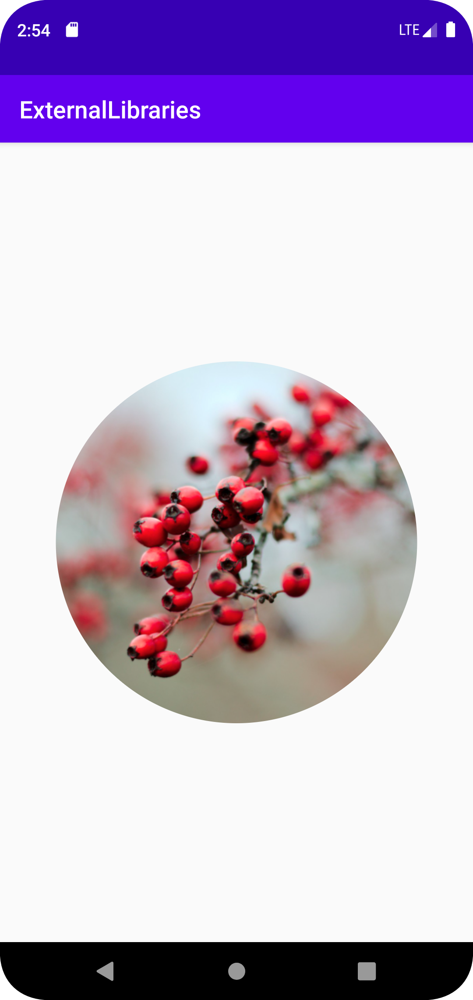

# Rapport

Den här gången var uppgiften var att hitta ett externt bibliotek och lägga in det i appen och sen använda sig av det i layouten. 
Till att börja med googlade jag bara på populära bibliotek, men då det var väldigt svårt att få grepp om hur de skulle användas utan att ha en färdig app så behövde det bli mer specifikt. 
Jag sökte på olkika color-pickers, med tanken att kunna lägga till en bild och sen color-picka från den. 
Efter att jag hämtat bilden kom jag fram till att jag inte förstod hur biblioteket jag valt fungerade, och jag inte visste hur det skulle läggas in.
Det såg även ut att använda sig av Maven. 
Så för att kunna använda mig av bilen jag hittade letade jag istället efter bild-relaterade bibliotek. 
Då ramar nämnts tidigare i föreläsningen så letade jag reda på ett bibliotek för att göra bilderna rundade. 
Det var betydligt mycket lättare att förstå sig på. Den behövde bara en rad under "dependencies" och sen en typ av imageview för att kunna användas. 

```
<de.hdodenhof.circleimageview.CircleImageView
    android:id="@+id/img_berry"
    android:layout_width="match_parent"
    ...
```
Figur 1     Kod från activity_main

```
implementation 'de.hdodenhof:circleimageview:3.1.0'
```
Figur 2     Koden som behövdes under dependencies

Fördelar med detta bibliotek var att det var väldigt lätt att implementera, eftersom den bara behövde två rader kod, och ingen java. 
Det var även möjligt att förändra designen av ramen, så det var även lite mer flexibelt och kunde passa flera olika appar.
Den behövde inga extra permissions för att fungera heller. 
Det är möjligt att en nackdel är att det är så litet, så behöver en mycket mer olika funktionalitet bör en kanske försöka hitta något annat.

